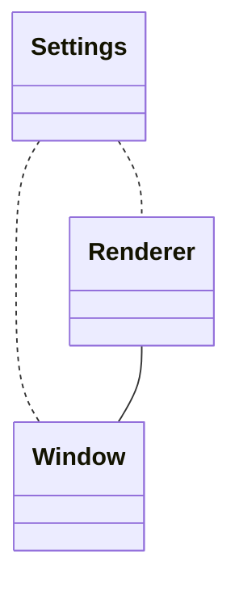

# Klassendiagramm Kapitel 2

Beispiel:

```mermaid
classDiagram
    class Settings {
    }
    class Window {
    }
    class Renderer {
    }
    Settings .. Window
    Settings .. Renderer
    Renderer -- Window
```