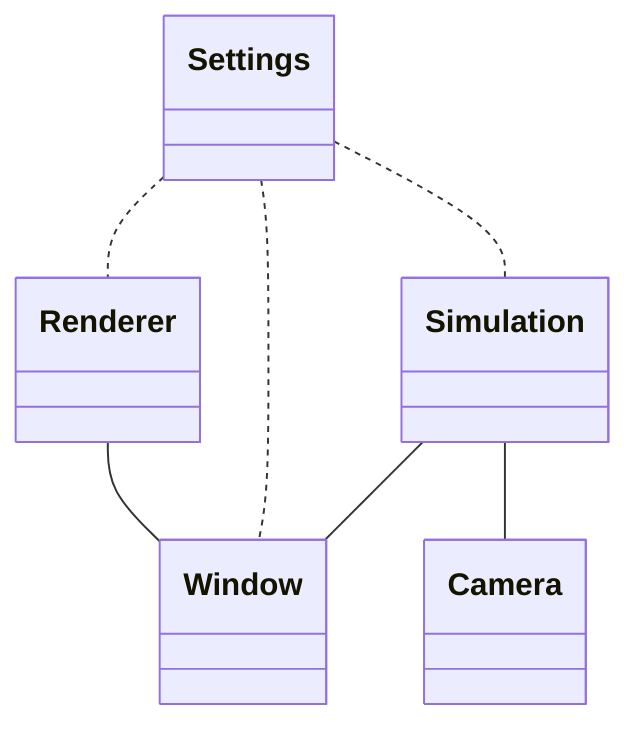

# Klassendiagramm Kapitel 3

Beispiel:

```mermaid
classDiagram
    class Renderer {
    }
    class Simulation {
    }
    class Settings {
    }
    class Camera {
    }
    class Window {
    }
    Renderer -- Window
    Simulation -- Window
    Simulation -- Camera
    Settings .. Renderer
    Settings .. Window
    Settings .. Simulation
```