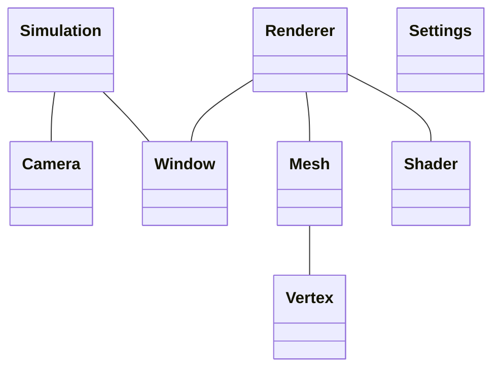

# Klassendiagramm Kapitel 4

Beispiel:

```mermaid
classDiagram
    class Renderer {
    }
    class Simulation {
    }
    class Settings {
    }
    class Window {
    }
    class Camera {
    }
    class Mesh {
    }
    class Shader {
    }
    class Vertex {
    }
    
    Simulation -- Camera
    Simulation -- Window

    Renderer -- Window
    Renderer -- Mesh
    Renderer -- Shader
    
    Mesh -- Vertex

```