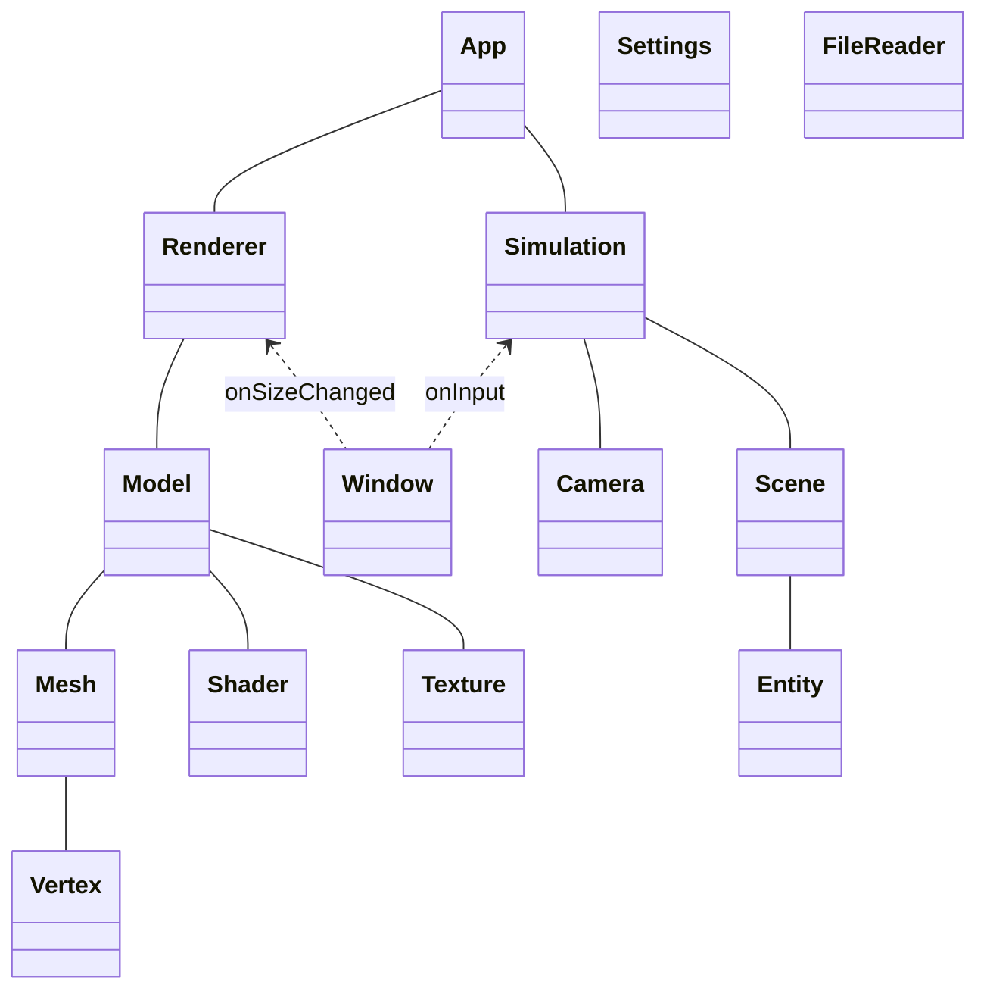

# Klassendiagramm Kapitel 10

Beispiel:

```mermaid
classDiagram
    class App {
    }
    class Window {
    }
    class Renderer {
    }
    class Simulation {
    }
    class Settings {
    }
    class FileReader {
    }
    class Camera {
    }
    class Mesh {
    }
    class Shader {
    }
    class Vertex {
    }
    class Entity {
    }
    class Model {
    }
    class Scene {
    }
    class Texture {
    }

    App -- Renderer
    App -- Simulation

    Renderer -- Model
    Renderer <.. Window : onSizeChanged
    
    Simulation <.. Window : onInput
    Simulation -- Camera
    Simulation -- Scene


    Scene -- Entity

    Model -- Mesh
    Model -- Shader
    Model -- Texture
    
    Mesh -- Vertex
```